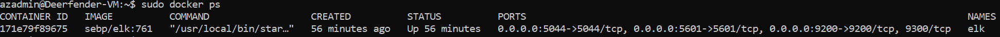
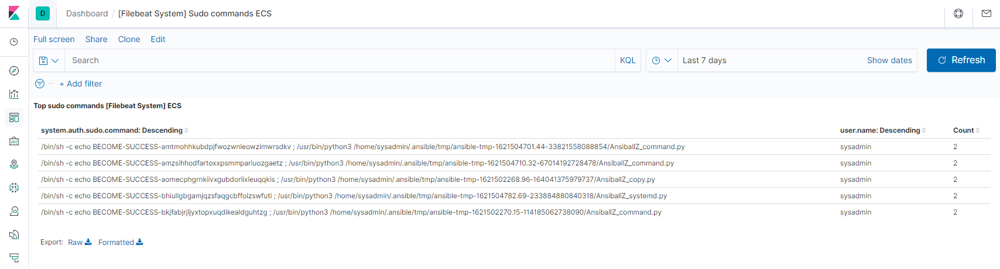
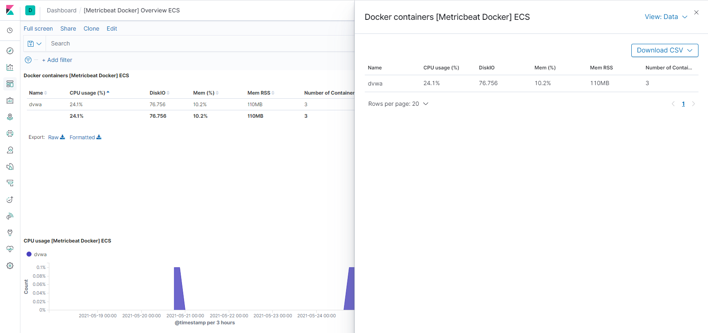
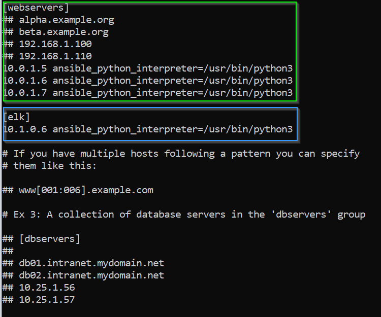

<p align="center"><p>

<h1 align="center" />- &nbsp; Deerfenders &nbsp; -
<h2 align="center" />A U T O M A T E D &nbsp;&nbsp; E L K &nbsp;&nbsp S T A C K &nbsp;&nbsp; D E P L O Y M E N T
<h1 align="center"></h1>

<br />


# README Overview


This document contains the following details:
- Description of the topology
- ELK configuration
  - Beats in use
  - Machines being monitored
- Access policies
- How to use the Ansible build
- Extra scripts and screenshots in the repository folders 

<br />

# Contributers

While the Azure Virtual lab environment IP addresses, files, and screenshots referred to in this document are specific to the author's environment, all members of the Deefender project team contributed to this readme file.

<br />

# Virtual Lab Environmment

The files in this repository were used to configure the network depicted below. 

<br />
<br />


<br />
<br />
<h1 align="center"></h1>

# Playbook Files

These files have been tested and used to generate a live ELK deployment on Azure. They can be used to either recreate the entire deployment pictured above. Alternatively, select portions of the playbook files may be used to install only certain pieces of it, such as Filebeat.

For this project we used specific isolated playbooks for each of these modules. See the `Ansible` project repository folder for all playbook and other configuration files.


## elk-playbook.yml

  ```
- name: Configure Elk VM with Docker
  hosts: elk
  become: true
  tasks:
    # Use apt module
    - name: Install docker.io
      apt:
        update_cache: yes
        force_apt_get: yes
        name: docker.io
        state: present

    # Use apt module
    - name: Install python3-pip
      apt:
        force_apt_get: yes
        name: python3-pip
        state: present

    # Use pip module (It will default to pip3)
    - name: Install Docker module
      pip:
        name: docker
        state: present

    # Use command module
    - name: Increase virtual memory
      command: sysctl -w vm.max_map_count=262144

    # Use sysctl module
    - name: Use more memory
      sysctl:
        name: vm.max_map_count
        value: 262144
        state: present
        reload: yes

    # Use docker_container module
    - name: download and launch a docker elk container
      docker_container:
        name: elk
        image: sebp/elk:761
        state: started
        restart_policy: always
        # Ports that ELK runs on
        published_ports:
          - 5601:5601
          - 9200:9200
          - 5044:5044

    # Use systemd module
    - name: Enable service docker on boot
      systemd:
        name: docker
        enabled: yes
  ```
<br/>

## filebeat-playbook.yml

```
---
- name: Install and start filebeat
  hosts: webservers
  become: yes
  tasks:

  - name: download filebeat deb
    get_url:
      url: https://artifacts.elastic.co/downloads/beats/filebeat/filebeat-7.6.1-amd64.deb
      dest: ~/filebeat-7.6.1-amd64.deb

  - name: install filebeat deb
    command: dpkg -i filebeat-7.6.1-amd64.deb

  - name: drop in filebeat.yml
    copy:
      src: /etc/ansible/files/filebeat-config.yml
      dest: /etc/filebeat/filebeat.yml

  - name: enable and configure system module
    command: filebeat modules enable system

  - name: setup filebeat
    command: filebeat setup

  - name: start filebeat service
    service:
      name: filebeat
      state: started

  - name: enable service filebeat on boot
    systemd:
      name: filebeat
      enabled: yes
...
```


## metricbeat-config.yml

```
---
- name: Install and start metricbeat
  hosts: webservers
  become: yes
  tasks:

  - name: download metricbeat deb
    get_url:
            url: https://artifacts.elastic.co/downloads/beats/metricbeat/metricbeat-7.6.1-amd64.deb
            dest: ~/metricbeat-7.6.1-amd64.deb

  - name: install filebeat deb
    command: dpkg -i metricbeat-7.6.1-amd64.deb

  - name: drop in filebeat.yml
    copy:
      src: /etc/ansible/files/metricbeat-config.yml
      dest: /etc/metricbeat/metricbeat.yml

  - name: enable the docker module
    command: metricbeat modules enable docker

  - name: setup metricbeat
    command: metricbeat setup

  - name: start metricbeat service
    service:
            name: metricbeat
            state: started

  - name: enable service metricbeat on boot
    systemd:
      name: metricbeat
      enabled: yes
...
```


<br />
<br />

# Description of the Topology

The main purpose of this network is to expose a load-balanced and monitored instance of DVWA, the D*mn Vulnerable Web Application.

Load balancing ensures that the application will be highly available, in addition to restricting direct access to the network.
- A load balancer is a device (physical or virtual) that efficiently distributes network traffic based on configured logic to a pool of backend servers, also known as a server farm or server pool. Load balancers provide multiple advantages; including, availability, scalability, redundancy, and efficiency. Direct access to servers within the pool is not required nor available which reduces the attack surface of the web service.

- The Jump Box acts as a dual purpose control node and is the gateway to the Azure virtual network. A docker ansible image was implemented to provision and accesss the web servers in the hosts group. Advantages of this include having one point of external access and the ability to automate the provisioning of new servers / update of existing servers. By using an ansible docker container, this element is more portable where an Adminisntrator could move the docker container to other machines, another region or jump point and then reprovision as neccessary. 

Integrating an ELK server allows users to easily monitor the vulnerable VMs for changes to the resources and system logs.
- Filebeat monitors log files or specified locations. Once the data is collected it is then forwarded to Elasticsearch for visualisation via Kibana thereafter.

- Metricbeat collects statistics and metric data from the respective operating systems periodically before it's sent to Elasticsearch to be viewed via Kibana.

# Virtual Machine Network Settings and O/S

The configuration details of each machine may be found below.

| Name                       | Function   | Private IP Address | Public IP Address  | Operating System     |
|----------------------------|------------|--------------------|--------------------|----------------------|
| Jump-Box-Provisioner       | Gateway    | 10.0.1.4           | 52.189.225.216     | Linux (Ubuntu 18.04) |
| Web-1                      | Web Server | 10.0.1.5           | N/A                | Linux (Ubuntu 18.04) |
| Web-2                      | Web Server | 10.0.1.6           | N/A                | Linux (Ubuntu 18.04) |
| Web-3                      | Web Server | 10.0.1.7           | N/A                | Linux (Ubuntu 18.04) |
| Deerfender-VM              | Elk Stack  | 10.1.0.6           | 20.53.8.209        | Linux (Ubuntu 18.04) |

<br />

# Access Policies
__Note - All public IP references have been redacted to ensure privacy of the developers__
<br />

The machines on the internal network are not exposed to the public Internet. 

Only the Jump-Box-Provisioner can accept SSH connections from the Internet. Access to this machine is only allowed from the developer's public IP address, depicted as 193.x.x.239 in the Virtual Lab Environment diagram above.

As the developer's public IP address is not static, the access policy must be updated each time their public IP address changes. The developer can visit the following page to obtained their currently assigned public IP address. [https://www.whatismyip.com/](https://www.whatismyip.com/)


The ELK server accepts HTTP requests from the Developer's public IP address on port 5601 to serve pages from Kibana, however shell access to the ELK server is only available from the ansible container on the Jump-Box-Provisioner via SSH using the the public/private keys created during initial setup.
 

The Load balancer can also accept HTTP (tcp:80) connections from the Internet. Access to this machine is only allowed from the same IP address (Author's public IP address)

Machines within the network can only be accessed via SSH from the Ansible container hosted on the Jump-Box-Provisioner machine (10.0.1.4).

A summary of the access policies in place can be found in the table below.

## Network Security Groups - Custom Inbound Rules 

| NSG Name          | Priority | Inbound SG Name             | Port | Protocol | Source      | Destination    | Action |
|-------------------|----------|-----------------------------|------|----------|-------------|----------------|--------|
| RednetNSG         | 1000     | AllowSSH-Ext-Jump           | 22   | TCP      | 193.x.x.239 | 10.0.1.4       | Allow  |
| RednetNSG         | 2000     | AllowHTTP-Ext-Int           | 80   | TCP      | 193.x.x.239 | VirtualNetwork | Allow  |
| Deerfender-VM-nsg | 1000     | KibanaTCP                   | 5601 | TCP      | 193.x.x.239 | VirtualNetwork | Allow  |

<br />

Based on the security rules above, the following table depicts which hosts are publically accessable and how.

<br />

| Host/Application                            | Publicly Accessable                    | Allowed IP Addresses | Security Rule Name | Port | Protocol |
|---------------------------------------------|----------------------------------------|----------------------|--------------------|------|----------|
| Jump-Box-Provisioner console/shell          | Yes                                    | 192.x.x.239          | AllowSSH-Ext-Jump  | 22   | TCP      |
| Kibana Web Application on Deerfender-VM     | Yes                                    | 192.x.x.239          | KibanaTCP          | 5601 | TCP      |
| DVWA Web Application on Web-1, Web-2, Web-3 | Yes (via load balancer 40.127.92.127)  | 192.x.x.239          | AllowHTTP-Ext-Int  | 80   | TCP      |
| Deerfender-VM Console/shell                 | No                                     |                      |                    |      |          |
| Web-1 console/shell                         | No                                     |                      |                    |      |          |
| Web-2 console/shell                         | No                                     |                      |                    |      |          |
| Web-3 console/shell                         | No                                     |                      |                    |      |          |

<br />
<br />
<br />

# Elk Configuration

Ansible was used to automate configuration of the ELK machine. No configuration was performed manually, which is advantageous because of the following:
- Skill Level: Little to no coding skills required
- Consistency: The ability to remotely configure and setup multiple instances with the exact same environment at ease by just specifying the host group.
- Flexibility: Same configurations are possible on any environment no matter where it is being deployed.
- Simple to Learn: Easy to use for beginners and professionals, being in YAML it also super easy to read and understand.
- Dependancies: No agents are required to be setup as dependancies on the remote machines
- Timeliness: Quick implementation of services and applications.

The ELK playbook implements the following tasks:
- Install Docker and Python3 using the apt module
- Increase ELK Server's virtual memory via systemctl
- After running Docker via pip, install the ELK image using Docker container, publishing ports 5601, 9200 and 5044
- Enabling Docker Service on boot to ensure availability.


The following screenshot displays the result of running `docker ps` after successfully configuring the ELK instance.



<br />
<br />

# Target Machines & Beats

The ELK server is configured to monitor the following machines:
- 10.0.1.5 - Web Server 1 (Web-1)
- 10.0.1.6 - Web Server 2 (Web-2)
- 10.0.1.7 - Web Server 3 (Web-3)

We have installed the following Beats on these machines:
## Filebeat
  - Type of data collected: Log data including SSH logins, sudo commands run, and all other log data from the specified locations
  - Example below of sudo command monitoring:

  
  
## Metricbeat
  - Type of data collected: System statistics such as CPU Usage, Memory, Network Activity, Disk IO, and Docker Containers per Host
  - Example below of CPU/Memory Usage monitoring:



<br />
<br />

# Using the Playbooks

In order to use the playbooks, you will need to have an Ansible control node already configured. Assuming you have such a control node provisioned: 

- SSH into the control node and attach to the Ansible container

    ```
    Example:
    
    $ ssh <azadmin@JumphostIP>
    $ azadmin@Jump-Box-Provisioner:/etc$ sudo docker start <congtainername>
    $ azadmin@Jump-Box-Provisioner:/etc$ sudo docker attach <congtainername>
    $ root@957e408d0478:~# 
    ```

- Copy the YAML files located in this repository's <a href="Ansible">`Ansible`</a> folder to your Ansible control node's `/etc/ansible/roles` folder.
- Update the /etc/ansible/hosts file to include the ELK server IP and any hosts to be monitored.  
In the following example, the ELK IP is configured under the [elk] group, and the 3 Webserver IPs are configured under the [webservers] group. 

    
 
- Ensure the interpreter is set to ```ansible_python_interpreter=/usr/bin/python3``` as seen in the image above
- Run the ELK playbook, followed by the Filebeat and Metricbeat playbooks
    ```
    # Run the ELK Playbook:
    $ root@957e408d0478:/etc/ansible/roles# ansible-playbook elk-playbook.yml

    # Run the Filebeat Playbook:
    $ root@957e408d0478:/etc/ansible/roles# ansible-playbook filebeat-playbook.yml

    # Run the Metricbeat Playbook:
    $ root@957e408d0478:/etc/ansible/roles# ansible-playbook metricbeat-playbook.yml
    ```
-  Using a Web browser, navigate to **<ELK_SERVER_IP>:5601** to check that the installation has worked as expected.


<br />

## Congratulations !   
You now have a fully functional ELK server monitoring logs from multiple web servers.


<br />

